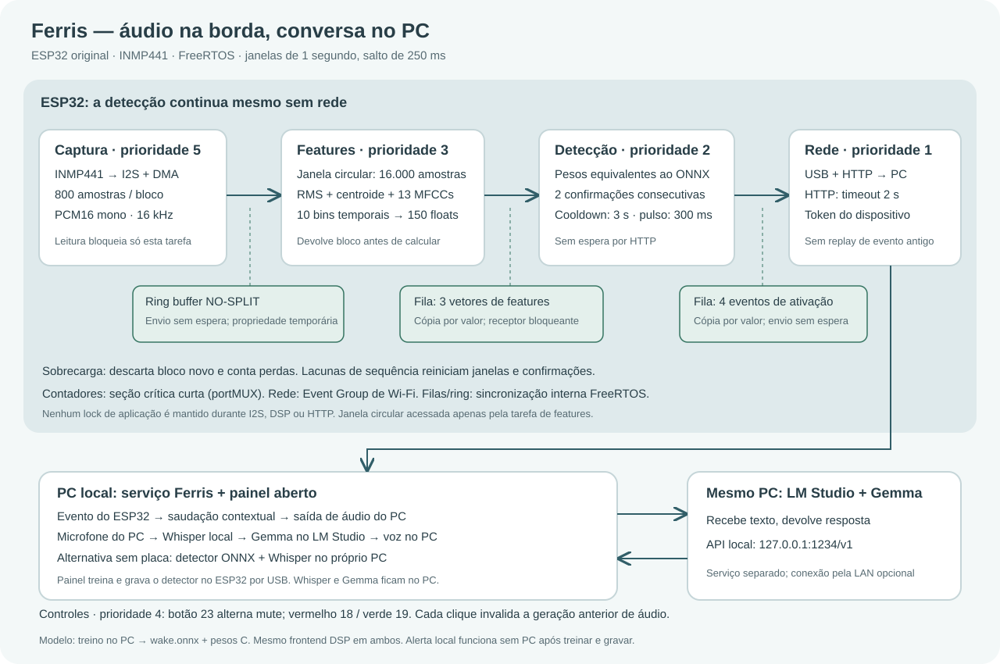

## Ferris

&emsp; Minha ideia aqui foi construir uma pequena companhia que eu pudesse chamar pelo nome, falar alguma coisa e receber uma resposta em português, tipo uma Alexa, só que com um ESP32 na mesa e os modelos rodando nos meus próprios computadores. O ponto de partida é bem simples: alguém fala "Ferris", ele cumprimenta de acordo com o horário e espera uma pergunta. Depois de responder ele volta a esperar o nome, até porque ninguém merece um assistente entrando em toda conversa da sala hehe.

<br>

&emsp; Separei o trabalho entre a placa e os computadores porque cada um tem sua função nessa história. O ESP32 fica com o microfone, o detector e o botão de mute; o PC conectado nele fica com o painel e o treino; e o outro PC faz a parte pesada com Whisper, Gemma no LM Studio e a voz Qwen. Coloquei o que é nosso no Docker Compose para não precisar montar um ambiente Python na mão toda vez que quiser usar o Ferris. O LM Studio continua instalado no PC de destino, ele já resolve a parte de servir o Gemma.

<br>

### Como rodar

&emsp; Precisa do Docker com Compose. Na montagem atual o PC do ESP32 usa Linux, e o PC de destino está em `192.168.15.17`. O endereço da conversa é `1234/v1`, e o da voz é `8770/v1`, são dois serviços diferentes!

**Neste PC, com o ESP32 conectado por USB:**

```sh
cp .env.example .env  # só na primeira vez
# Se sua porta não for ttyUSB0, ajuste SERIAL_PORT no .env.
echo "SERIAL_GID=$(stat -c '%g' /dev/ttyUSB0)" >> .env
docker compose up -d --build ferris
```

Abra **http://localhost:8765**. Pronto, o painel está no ar! Em **Conexão**, confira:

| Campo | Valor nesta instalação |
| --- | --- |
| LM Studio | `http://192.168.15.17:1234/v1` |
| Modelo | `google/gemma-4-12b-qat` |
| Serviço de Whisper e voz | `http://192.168.15.17:8770/v1` |

Clique em **Buscar modelos** e **Verificar Whisper e voz**. Salvar aplica a conexão na hora e mantém a escolha depois de reiniciar. Se mudar o `.env` e continuar aparecendo o endereço antigo, é porque o que foi salvo no painel tem prioridade; altere por lá.

> obs: se a versão antiga estiver rodando pelo Python, encerre ela primeiro. A porta 8765 e o USB precisam ficar livres para o container.

<br>

**No PC de destino, dentro deste mesmo repositório:**

```sh
cp .env.example .env  # só se ainda não existir
docker compose up -d --build voice
```

&emsp; Na primeira vez ele baixa Whisper small e Qwen3-TTS ONNX e depois inicia o worker na porta **8770**. Os arquivos ficam em `data/`, então não precisa baixar de novo a cada subida. Se os modelos já estiverem nessa pasta, o container aproveita os mesmos arquivos. Essa primeira execução demora mais, acompanhe com `docker compose logs -f voice`.

&emsp; No LM Studio, mantenha o Gemma carregado e o servidor acessível pela rede na porta **1234**. Se já existir um worker de voz iniciado pelo Python na 8770, pare esse processo antes de subir o container. O Compose deste PC sobe só `voice`, não abre o painel nem tenta acessar o ESP32.

<br>

**Para testar o painel sem a placa:**

```sh
COMPOSE_FILE=compose.yaml docker compose up -d --build ferris
```

**Comandos do dia a dia:**

```sh
docker compose ps                 # vê o que está rodando
docker compose logs -f ferris      # logs do painel
docker compose logs -f voice       # no PC que está gerando a voz
docker compose up -d --build ferris # atualiza o painel depois de mudar o código
docker compose down               # para os containers; data/ e models/ continuam aqui
```

---

### Falando com ele

&emsp; Deixei a tela principal com a conversa e o microfone. **Ajustar voz e microfone** abre os testes e a escolha da voz; **Conexão** reúne os servidores e as chaves; **Minha voz** fica com as gravações e o treino. As opções que uso menos ficam recolhidas para o painel não virar um manual.

&emsp; Ative o microfone no painel, em **Ajustar voz e microfone**, escolha **ESP32 + Whisper remoto** e diga "Ferris". A placa detecta o nome, ele fala a saudação e abre uma janela de 20 segundos para uma pergunta. Após começar a fala, uma pausa de 1 segundo envia a pergunta automaticamente. Pausas menores mantêm a gravação, até o limite de 12 segundos. `MIC_THRESHOLD`, `QUESTION_SILENCE_MS` e `QUESTION_MAX_SECONDS` no `.env` ajustam isso. A pergunta usa o microfone do navegador, vai para o Whisper no PC de destino e só o texto segue para o Gemma. A voz da resposta também é gerada no destino, mas toca no navegador deste PC. A placa ainda não transmite a pergunta nem reproduz a resposta.

&emsp; Depois disso, para perguntar de novo é só chamar "Ferris" outra vez. O botão **Parar** interrompe a resposta, e o botão físico bloqueia a escuta. Também dá para conversar por texto ou abrir **Ajustar voz e microfone** e usar **Chamar Ferris** para testar a saudação sem depender do detector.

> obs: abra o painel em `localhost`, porque o navegador precisa de um contexto seguro para liberar o microfone. E a voz Qwen ainda leva alguns segundos para gerar uma frase nova, o cache ajuda nas falas repetidas, não faz milagre hehe.

&emsp; Para pesquisas Google, coloque uma chave SerpApi em **Conexão**. Sem ela, o Ferris devolve um link de busca. Ele foi feito para conversar e pesquisar, não para programar, editar arquivos ou executar comandos.

---

### Gravando e treinando

&emsp; A aba **Minha voz** é onde preparo os exemplos. Escolha **ESP32** como microfone, dê um nome para a sessão e grave a palavra "Ferris", outras palavras e ruído do ambiente. As gravações de treino vêm do microfone da placa por USB, não do microfone do navegador quando essa opção está selecionada.

1. Grave pelo menos 12 exemplos de Ferris e 12 negativos.
2. Para um primeiro teste na mesma sessão, escolha **Experimental**.
3. Para avaliar melhor, faça pelo menos quatro sessões mudando distância, ambiente ou momento, com positivos e negativos em cada uma.
4. Clique em **Treinar e usar modelo**.

&emsp; O treino roda neste PC, exporta uma rede pequena com 24 neurônios intermediários em ONNX e os mesmos pesos em C para a placa. O Whisper e o Gemma continuam no PC de destino. Os arquivos ficam em `models/`, e o cabeçalho que vai para a placa fica em `models/model_weights.h`. O modelo anterior continua disponível enquanto o novo treina. O resultado experimental serve para testar, não para dizer que vai funcionar igualmente bem em outro ambiente.

&emsp; O aumento de dados acontece dentro do treino e só no conjunto de treino, com uma receita por classe. Ficar gerando arquivos aumentados dentro de `data/recordings` colocaria cópias quase idênticas em validação e teste, e as métricas passariam a medir o que o modelo já viu.

| Classe | O que recebe | Por quê |
|---|---|---|
| Ferris | deslocamento curto, ganho, mistura com ambiente em SNR variável, ritmo entre 0,93x e 1,07x | distância, ruído e velocidade de fala mudam na vida real; a palavra precisa continuar inteira e reconhecível |
| Outras palavras | o mesmo tratamento dos positivos | senão o modelo separa as classes pelo nível de ruído ou pelo volume em vez do conteúdo |
| Ambiente | ganho numa faixa larga, soma de dois ambientes, inversão no tempo | é a classe sem palavra, então aceita mais liberdade; nada aqui pode receber fala |

&emsp; O ambiente usado nas misturas sai só das gravações de treino. Pegar ruído de validação ou de teste colocaria áudio desses conjuntos dentro do modelo. O `wake.json` registra quantas janelas cada classe ganhou. Cortes da própria palavra não viram negativos, pois ainda podem conter o nome e ensinar o detector a rejeitá-lo. As variações de volume e posição preservam a maior parte da energia da fala.

&emsp; Falso positivo por janela não é falso disparo. A placa só ativa com duas janelas positivas seguidas e espera 3 segundos depois de cada ativação, então o número que importa é falsa ativação por hora em áudio contínuo, medida por `tools/training/benchmark.py`, e não a acurácia global. O treino agora escolhe o limiar na validação reproduzindo as gravações com janelas de 1 segundo, avanço de 250 ms e duas confirmações. O teste reservado usa a mesma regra; os números por gravação ainda não substituem um teste contínuo em outro ambiente.

&emsp; Com muitos áudios da internet, o treino sorteia até 1.200 negativos importados por classe e mantém todos os positivos e gravações próprias da sua parte de treino. Cada gravação tem peso próprio, sem favorecer ruídos longos. Quando há áudios locais e importados, os locais recebem 70% do peso em cada classe. Validação e teste mantêm todos os arquivos reservados, e o limiar também considera os falsos acionamentos nas gravações locais. Assim o volume de downloads não torna cada treino enorme. Se as gravações próprias vierem da mesma sessão, use **Experimental** e confirme o resultado depois com áudios novos. O modelo também precisa usar a mesma versão do extrator no PC e na placa.

&emsp; Para ouvir o que cada transformação faz, sem alterar nada:

```sh
python tools/training/augment_data.py
```

&emsp; Ele escreve exemplos em `data/augment-preview/`, que fica fora do Git.

**Para gravar o modelo novo no ESP32:**

```sh
docker compose stop ferris
# Na primeira vez, baixa a imagem do ESP-IDF; ela é grande.
docker compose run --rm firmware
docker compose start ferris
```

&emsp; Separei a gravação do firmware porque o painel já está usando a serial para receber os eventos. Esses comandos liberam a porta, compilam com ESP-IDF 5.4.2, gravam a placa e devolvem o USB para o Ferris. Dentro do Docker, o botão do painel faz o treino; a gravação da placa é essa etapa acima. Não precisa instalar ESP-IDF no sistema.

---

### Como liguei as peças

| Peça | ESP32 |
| --- | --- |
| Microfone VDD | 3V3 |
| Microfone GND e L/R | GND |
| Microfone SD | GPIO 22 |
| Microfone SCK | GPIO 26 |
| Microfone WS | GPIO 25 |
| LED vermelho | GPIO 18, com resistor de 220 a 330 Ω em série |
| LED verde | GPIO 19, com resistor de 220 a 330 Ω em série |
| Botão de mute | GPIO 23 e GND, usando pull-up interno |

&emsp; Os cátodos dos LEDs vão ao GND. O vermelho indica mute, o verde indica escuta e pulsa quando o nome é detectado. O microfone é de **3,3 V**. O botão alterna o mute a cada clique, não precisa ficar segurando.

---

### Onde ficou cada coisa

```text
ferris/             servidor do painel, cliente LM Studio, áudio e worker de voz
  static/           HTML, CSS e JavaScript do painel
  vendor/           adaptador ONNX e sua licença
tools/
  models/           download dos modelos Whisper e TTS
  training/         treino, augmentação, DSP e benchmark
  firmware/         gravação do ESP32 fora do Compose
  testing/          teste do navegador
firmware/           aplicação FreeRTOS e componentes C compartilhados
tests/              testes automatizados
docker/             inicialização, healthcheck e gravação da placa
assets/             diagrama das tarefas
data/               gravações, configurações e modelos de voz, fora do Git
models/             detector treinado e pesos exportados, fora do Git
compose.yaml        painel, voz, firmware e testes
compose.usb.yaml    acesso opcional ao USB no Linux
```

&emsp; No firmware, captura, controles, extração de features, detecção, gravação e envio de eventos ficam em tarefas separadas. A captura passa blocos de áudio para um ring buffer, a extração calcula RMS, centroide e MFCCs, e a detecção exige duas janelas positivas. Antes das contas, a janela perde a média, o que tira o offset do INMP441 que entrava inteiro no RMS, e a trilha espectral recebe pré-ênfase de 0,97, que realça as formantes. O RMS continua sendo medido sem pré-ênfase, para seguir sendo energia. O mesmo C roda no PC e na placa, então filtro e features são idênticos nos dois lados. As filas não seguram a captura esperando rede, e o mute invalida os dados antigos que ainda estavam em trânsito.

&emsp; As prioridades têm nome em `main.c` e seguem período mais curto, prioridade maior. A captura é a única com prazo firme, porque bloco de I2S perdido não volta; rede e gravação são soft e ficam no fim da fila. A tarefa de controles é periódica de 10 ms e usa `xTaskDelayUntil`, que conta a partir do despertar anterior, então o tempo do laço não empurra o período.

&emsp; O ciclo da palavra de ativação é uma máquina de estados em `firmware/components/ferris_controls`: ela escuta, confirma na segunda janela positiva seguida e silencia por 3 segundos para não repetir o alerta na mesma fala. Uma lacuna na sequência ou uma troca de mute recomeçam a confirmação, porque duas janelas descontínuas não são a mesma palavra. Como é C puro, ela é testada no PC junto com o debounce do botão.

&emsp; O log de diagnóstico sai uma vez por segundo com as latências, os contadores de descarte, a menor folga de pilha entre as tarefas e o heap livre. No ESP-IDF esses dois valores são em bytes, e não em words como no FreeRTOS original, o que muda a leitura.



---

### Testes

```sh
docker compose build test
docker compose run --rm test
```

&emsp; A suíte cobre API, mute, gravação, treino, equivalência ONNX/C, conexão remota e cancelamento de voz. Ela usa dados temporários, não treina por cima das minhas gravações. O teste completo do navegador fica em `tools/testing/browser_smoke.mjs`; para desenvolvimento local, com Node e Chromium instalados:

```sh
python3 -m venv .venv
source .venv/bin/activate
pip install -e '.[train,device,voice,tts]'
PYTHON_BIN=.venv/bin/python node tools/testing/browser_smoke.mjs
```

---

### Se alguma coisa não subir

| O que aconteceu | O que conferir |
| --- | --- |
| Porta 8765 ou 8770 ocupada | Pare o processo Python antigo ou ajuste a porta no `.env` |
| USB não encontrado | Confira `SERIAL_PORT`; sem placa, use apenas `compose.yaml` |
| Permissão negada no USB | Confira `SERIAL_GID` com `stat -c '%g' /dev/ttyUSB0` e recrie o container |
| Permissão negada em `data/` ou `models/` | No Linux, ajuste `USER_ID` e `GROUP_ID` para os valores de `id -u` e `id -g` |
| Whisper ou voz indisponível | Veja `docker compose logs -f voice` no destino; confirme IP, porta e token no painel |
| Timeout nos dois serviços remotos | Confira se o destino está acordado e se o firewall permite 1234 e 8770 |
| Modelo aparece com outro nome | Use **Buscar modelos** e salve o identificador que o LM Studio devolveu |

&emsp; Se quiser exigir autenticação no worker, defina `VOICE_TOKEN` no `.env` do destino e salve o mesmo valor no campo de voz do painel. É separado da chave do LM Studio. O painel é publicado somente em `127.0.0.1`; o worker precisa ficar acessível pela rede para o outro PC conseguir chamar.

### Referências

https://docs.docker.com/compose/how-tos/profiles/

https://huggingface.co/Qwen/Qwen3-TTS-12Hz-1.7B-VoiceDesign

https://github.com/SYSTRAN/faster-whisper
